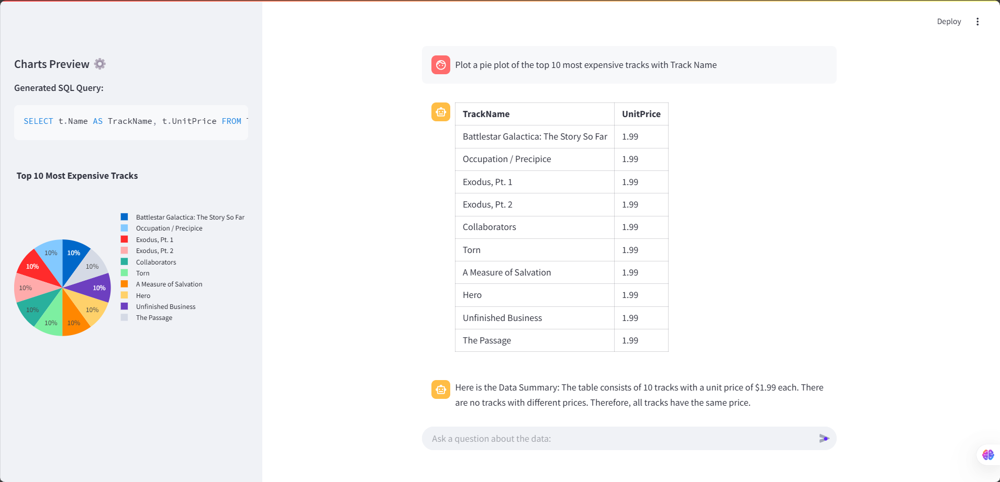
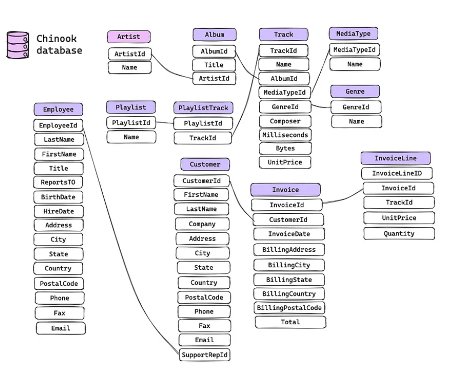

# Text2SQL Chatbot

The Text2SQL Chatbot is an advanced tool that allows users to interact with a SQL-driven assistant to query and explore data seamlessly. The chatbot can generate SQL queries from natural language input, execute them, and provide tabular responses with insights. Additionally, it has the capability to generate charts based on user queries.

## Demo

Here are some screenshots of the application in action:


_Figure 1: User interacting with the chatbot and receiving a tabular response._


_Figure 2: User receiving a chart based on their query._

## Database Schema

The Text2SQL Chatbot uses the Chinook database, which is a sample database representing a digital media store. Below is the schema of the Chinook database:


_Figure 3: Chinook Database Schema._

The Chinook database includes tables such as:

- **Albums**: Stores information about music albums.
- **Artists**: Stores information about music artists.
- **Customers**: Stores information about customers.
- **Employees**: Stores information about employees.
- **Genres**: Stores information about music genres.
- **Invoices**: Stores information about invoices.
- **InvoiceLines**: Stores information about individual invoice items.
- **MediaTypes**: Stores information about media types.
- **Playlists**: Stores information about playlists.
- **PlaylistTrack**: Stores information about the tracks in playlists.
- **Tracks**: Stores information about music tracks.

## Installation Steps

Follow these steps to set up the environment, install the required dependencies, and run the application.

### Step 1: Create a Conda Environment

First, create a new Conda environment:

```bash
conda create --name chatbot-sql-agent python=3.9
```

Activate the newly created environment:

```bash
conda activate chatbot-sql-agent
```

### Step 2: Install Required Dependencies

Install the required dependencies listed in the `requirements.txt` file:

```bash
pip install -r requirements.txt
```

### Step 3: Run the Application

Run the Streamlit application using the following command:

```bash
streamlit run app.py
```

This will start the Streamlit server and open the application in your default web browser.

## Additional Notes

- Ensure you have an active internet connection to download the dependencies.
- If you encounter any issues, check the compatibility of the packages and the Python version.

## Contributing

We welcome contributions to the Text2SQL Chatbot project! Here are some guidelines to help you get started:

### Fork the Repository

1. Fork the repository on GitHub.
2. Clone your forked repository to your local machine:

```bash
git clone https://github.com/your-username/Stramlit-Chatbot-SQL-Agent.git
```

3. Navigate to the project directory:

```bash
cd Stramlit-Chatbot-SQL-Agent
```

### Create a Branch

Create a new branch for your feature or bug fix:

```bash
git checkout -b feature-or-bugfix-name
```

### Make Changes

Make your changes to the codebase. Ensure that your code follows the project's coding standards and passes all tests.

### Commit and Push

Commit your changes and push them to your forked repository:

```bash
git add .
git commit -m "Description of your changes"
git push origin feature-or-bugfix-name
```

### Create a Pull Request

1. Go to the original repository on GitHub.
2. Click on the "Pull Requests" tab.
3. Click the "New Pull Request" button.
4. Select your branch from the "compare" dropdown.
5. Click "Create Pull Request" and provide a description of your changes.

### Review Process

Your pull request will be reviewed by the maintainers. Please be patient as this process may take some time. You may be asked to make additional changes based on feedback.

Thank you for contributing to the Text2SQL Chatbot project!
